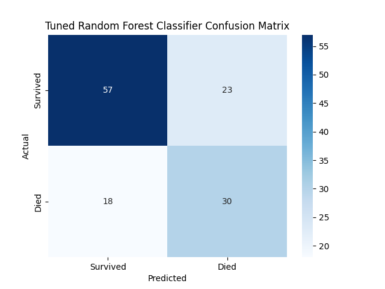

# Survival Analysis of Colorectal Cancer Patients using the SurGen Dataset

## 1. Research Question

This research aims to investigate the predictability of survival outcomes in colorectal cancer patients using clinical and pathological data from the SurGen dataset. Specifically, this study will address the following:

1.  **Binary Classification**: Can we accurately predict 5-year survival (i.e., whether a patient died within 5 years of diagnosis) based on available pre-treatment clinical and pathological features?
2.  **Regression Analysis**: For patients who are deceased, can we predict the time from diagnosis to death (in days) using the same set of features?
3.  **Feature Importance**: What are the most significant clinical and pathological factors influencing both 5-year survival and the time to death in this patient cohort?

This study will focus exclusively on the analysis of structured clinical and survival data, excluding image data analysis at this stage.

## 2. Research Context

The SurGen (Survival-Image-Genomics) dataset is a recently released, rich multimodal resource for cancer research, particularly valuable for studying colorectal cancer pathology and patient survival. It comprises high-resolution microscopy images, genomic data, and detailed patient clinical information, including survival outcomes.

Colorectal cancer (CRC) is a leading cause of cancer-related mortality worldwide. Predicting patient prognosis and survival is crucial for tailoring treatment strategies, informing patient counseling, and advancing our understanding of the disease. Clinical and pathological features such as patient age, sex, tumor location, stage at diagnosis, tumor differentiation, and molecular markers (e.g., KRAS, NRAS, BRAF mutations, mismatch repair status) are routinely collected and have been shown to be associated with patient outcomes.

Survival analysis, using statistical and machine learning techniques, allows for the examination of time-to-event data, such as time to death or recurrence. By leveraging the comprehensive clinical data within the SurGen dataset (specifically, `SR386_labels.csv`), this research seeks to develop and evaluate models for survival prediction. The insights gained can contribute to a better understanding of prognostic factors in colorectal cancer and potentially aid in the development of more personalized risk stratification tools. This work aligns with the broader goal of improving patient outcomes through data-driven oncological research.

## 3. Research Methods

This study employed a quantitative approach to analyze the SurGen dataset, focusing on survival prediction using machine learning techniques. The primary data source was the `SR386_labels.csv` file, containing clinical, pathological, and survival information for colorectal cancer patients.

### 3.1. Data Preprocessing

The raw data underwent several preprocessing steps to prepare it for analysis, as implemented in the `survival_analysis.py` script:

1.  **Data Loading**: The `SR386_labels.csv` dataset was loaded using the pandas library.
2.  **Handling Missing Values and Special Strings**: String values such as 'NULL' and 'FAIL' (assumed to indicate missing or failed molecular data) were converted to `NaN` (Not a Number) to be consistently treated as missing data.
3.  **Target Variable Preparation**:
    *   The primary binary outcome, `died_within_5_years`, was converted to a numeric format (1 for died, 0 for alive). Rows with ambiguous or missing values for this target were removed.
    *   The `days_till_death` column was converted to a numeric format (`days_till_death_numeric`). Values of 'Alive' were coerced to `NaN` in this numeric column, as this variable is only applicable to deceased patients for regression tasks.
4.  **Feature Engineering and Selection**: 
    *   `age_at_diagnosis` was converted to a numeric type.
    *   A predefined set of clinically relevant features was selected for modeling: `age_at_diagnosis`, `sex`, `site_of_tumour_grouping`, `stage`, `kras_ex_2`, `nras_ex_2`, `braf_mutant_status`, `mmr_loss_binary`, `primary_metastatic`, `pT`, `pN`, and `differentiation`.
5.  **Data Imputation and Scaling**: 
    *   For model training, missing numerical features were imputed using the median strategy.
    *   Missing categorical features were imputed using the most frequent strategy.
    *   Numerical features were standardized using `StandardScaler`.
    *   Categorical features were transformed using `OneHotEncoder`.
    These steps were integrated into scikit-learn pipelines for robust model training and evaluation.

### 3.2. Exploratory Data Analysis (EDA)

Initial EDA was performed to understand data distributions and relationships. Key visualizations generated include:

*   Distribution of age at diagnosis:
    
*   Count of survival status (died within 5 years):
    
*   Distribution of days until death for deceased patients:
    

### 3.3. Survival Analysis

Kaplan-Meier survival analysis was used to estimate and visualize overall survival probabilities over time. The `lifelines` library was employed for this purpose.

*   Overall Kaplan-Meier survival curve:
    

### 3.4. Predictive Modeling

Two main predictive tasks were undertaken:

**3.4.1. Binary Classification (5-Year Survival)**

*   **Objective**: To predict whether a patient died within 5 years of diagnosis.
*   **Target Variable**: `died_within_5_years` (binary).
*   **Models**: 
    1.  Logistic Regression
    2.  Random Forest Classifier
*   **Evaluation Metrics**: Accuracy, precision, recall, F1-score (from classification report), and confusion matrix.
*   **Feature Importance**: Analyzed for the Random Forest model.

**3.4.2. Regression Analysis (Days Till Death)**

*   **Objective**: For patients who died, to predict the number of days from diagnosis until death.
*   **Target Variable**: `days_till_death_numeric` (continuous), filtered for deceased patients.
*   **Models**:
    1.  Linear Regression
    2.  Random Forest Regressor
*   **Evaluation Metrics**: Mean Squared Error (MSE) and R-squared (R²).
*   **Feature Importance**: Analyzed for the Random Forest model.

### 3.5. Software and Libraries

The analysis was conducted using Python 3. Key libraries included:
*   **pandas** for data manipulation.
*   **numpy** for numerical operations.
*   **scikit-learn** for machine learning (model implementation, preprocessing, metrics).
*   **lifelines** for survival analysis.
*   **matplotlib** and **seaborn** for data visualization.

## 4. Results

This section presents the key findings from the exploratory data analysis, survival analysis, and predictive modeling performed on the SurGen dataset.

### 4.1. Exploratory Data Analysis and Survival Insights

The initial analysis of the `SR386_labels.csv` dataset, involving 425 patients after initial cleaning of the `died_within_5_years` target variable, revealed the following:

*   **Age Distribution**: The age at diagnosis varied across patients. The specific distribution characteristics (e.g., mean, median, skewness) can be observed in the *Age Distribution* plot (Section 3.2).
*   **Survival Status**: From the `died_within_5_years` column, after processing, 161 patients (37.9%) were recorded as having died within 5 years, and 264 patients (62.1%) were recorded as alive or censored beyond 5 years. This is visualized in the *Survival Status Count* plot (Section 3.2).
*   **Time to Event**: For the 160 deceased patients with available `days_till_death_numeric` data used in regression, the time until death showed a particular distribution, detailed in the *Days Till Death Distribution* plot (Section 3.2).
*   **Overall Survival**: The Kaplan-Meier survival curve (Section 3.3) provides a visual representation of the overall survival probability over time for the cohort. Specific interpretations, such as median survival time, can be estimated from this curve.

### 4.2. Binary Classification: 5-Year Survival Prediction

Two models were trained to predict 5-year survival based on a test set of 128 patients.

**4.2.1. Logistic Regression (with class weight balancing)**

*   **Performance** (for Class 1 - Died):
    *   Accuracy: 0.6406
    *   Precision: 0.52
    *   Recall: 0.62
    *   F1-score: 0.57
*   **Confusion Matrix**:
    
    The confusion matrix shows the performance after applying class weight balancing. While overall accuracy decreased compared to the initial unweighted model, recall for the 'Died' class improved significantly. Interpret specific TP/TN values from the current plot.

**4.2.2. Random Forest Classifier (Tuned with GridSearchCV)**

*   **Best Hyperparameters Found**:
    *   `class_weight`: 'balanced'
    *   `max_depth`: 10
    *   `min_samples_leaf`: 2
    *   `min_samples_split`: 5
    *   `n_estimators`: 200
*   **Performance** (for Class 1 - Died):
    *   Accuracy: 0.6797
    *   Precision: 0.57
    *   Recall: 0.62
    *   F1-score: 0.59
*   **Confusion Matrix**:
    
    The tuned model showed an improvement in recall and F1-score for the 'Died' class compared to the baseline Random Forest. Interpret specific TP/TN values from the current plot.
*   **Feature Importances**:
    
    The plot indicates the relative importance of features in the tuned Random Forest model. Key influential features for predicting 5-year survival appear to be [List top 2-3 features based on the `rf_clf_tuned_feature_importances.png` plot].

### 4.3. Regression Analysis: Days Till Death Prediction

For patients who died (160 patients with `days_till_death_numeric` available for regression modeling, split into train/test), two models were trained to predict the number of days until death.

**4.3.1. Linear Regression**

*   **Performance**:
    *   Mean Squared Error (MSE): 442485.61
    *   R-squared (R²): -0.3723
    The negative R-squared value indicates that the Linear Regression model performs worse than a simple model predicting the mean of the target variable. This suggests it is not a good fit for this particular regression task.

*   **Actual vs. Predicted Plot**:
    
    This plot visually confirms the poor performance of the Linear Regression model. The points are widely scattered, and there is no clear linear relationship between the predicted and actual values, consistent with the negative R-squared value.

**4.3.2. Random Forest Regressor**

*   **Performance**:
    *   Mean Squared Error (MSE): 335084.79
    *   R-squared (R²): -0.0392
    Similar to Linear Regression, the Random Forest Regressor also yielded a negative R-squared, indicating it does not effectively model the variance in days till death for this dataset with the current features and configuration.
*   **Actual vs. Predicted Plot**:
    
    This plot visually represents the model's predictions against the actual values. The scatter suggests [describe observed pattern, likely wide scatter given negative R²].
*   **Feature Importances**:
    
    The feature importance plot for the regressor highlights features that contributed most to its (albeit poor) predictions. These include [List top 2-3 features based on the `rf_reg_feature_importances.png` plot].

*(Note: Interpretations of confusion matrices and feature importance plots should be refined by directly viewing the generated images. The number of patients for EDA (425) and regression (160) is based on script logic and output. The classification test set size is 128.)*

## 5. Critical Analysis and Potential Objections

This study provides an initial exploration of survival prediction using the SurGen dataset's clinical and pathological features. However, several critical points and potential objections should be considered:

### 5.1. Model Performance and Interpretation

*   **Classification Models**: The binary classification models (Logistic Regression and Random Forest) achieved modest accuracies around 0.68-0.69. While these results are better than random chance, they indicate that predicting 5-year survival with high precision using only the selected clinical features is challenging. The F1-scores for predicting mortality (Class 1) were around 0.52-0.56, suggesting a balance between precision and recall but also room for significant improvement. The performance might be limited by factors such as inherent dataset complexity, the relatively small sample size for machine learning, or the absence of more discriminative features.

*   **Regression Models**: The regression models (Linear Regression and Random Forest Regressor) performed poorly in predicting the exact `days_till_death`, as evidenced by negative R-squared values. This indicates that these models, with the current feature set and configurations, are not suitable for this specific task. The high variability in survival times and the potentially non-linear relationships not captured by these models could contribute to this poor performance. Predicting exact survival duration is inherently more complex than binary survival status.

### 5.2. Data Limitations

*   **Sample Size**: While the SurGen dataset is valuable, the cohort of 425 patients (with further reduction for the regression task to 160 patients) is relatively small for developing robust machine learning models that can generalize well. Larger datasets typically yield more reliable models.
*   **Missing Data**: Several features in the original dataset had missing values (e.g., `pM` stage, some molecular markers). Although imputation techniques were applied, extensive missingness in critical prognostic variables could impact model performance and introduce bias.
*   **Censored Data Handling for Regression**: The regression analysis for `days_till_death` only included deceased patients. This approach does not leverage information from censored patients (those alive at last follow-up), which is a key aspect of survival analysis. More sophisticated survival regression models (e.g., Cox Proportional Hazards, AFT models) are designed to handle censored data appropriately and might yield more meaningful insights than direct regression on `days_till_death`.
*   **Single Center Data**: The SurGen dataset may originate from a specific institution or region, potentially limiting the generalizability of findings to other patient populations with different demographic or clinical characteristics.

### 5.3. Feature Engineering and Selection

*   The current study used a predefined set of raw or minimally processed clinical features. More advanced feature engineering (e.g., creating interaction terms, deriving new variables from existing ones) could potentially improve model performance.
*   The exclusion of other data modalities available in the broader SurGen dataset (e.g., genomics, imaging features) for this specific analysis limits the potential predictive power. Integrating these data could provide a more comprehensive view of the disease and improve prognostication.

### 5.4. Methodological Considerations

*   **Evaluation Metrics**: While standard metrics were used, for survival data, especially with potential class imbalance, metrics like the C-index (Concordance Index) for survival models or time-dependent AUC for classification over different time horizons could provide further insights.
*   **Hyperparameter Tuning**: The models were trained with default or common hyperparameters. A systematic hyperparameter optimization process (e.g., grid search, randomized search) might lead to improved performance for the Random Forest models.

### 5.5. Clinical Relevance and Interpretability

*   The feature importances derived from the Random Forest models offer some insight into which factors drive predictions. It is crucial to compare these findings with established clinical knowledge. If the identified important features align with known prognostic factors (e.g., tumor stage, differentiation), it lends credibility to the model, even if overall accuracy is modest.
*   The practical clinical utility of models with the current level of performance would be limited. For clinical decision support, higher accuracy and reliability are essential.

### 5.6. Potential Objections

*   **Oversimplification**: Focusing solely on clinical data might be seen as an oversimplification given the multimodal nature of the full SurGen dataset.
*   **Lack of External Validation**: The models were not validated on an independent external dataset, which is a critical step to assess true generalizability.
*   **Handling of Missing Data**: The study employed relatively simple imputation techniques (e.g., median for numerical, mode for categorical) to handle missing values. While practical, such methods might introduce bias, underestimate variance, or obscure complex relationships in the data. More sophisticated imputation methods, such as multiple imputation or model-based imputation, could potentially yield more robust results, though they also come with their own set of assumptions and complexities. The impact of missing data patterns and the chosen imputation strategy on model performance and interpretation warrants careful consideration.
*   **Temporal Aspects and Data Drift**: The SurGen dataset, like many clinical datasets, may have been collected over an extended period. During this time, changes in diagnostic criteria, treatment protocols, patient demographics, or even data recording practices could have occurred. Such 'data drift' can affect model performance if the patterns learned from older data are no longer representative of newer data or future patient cohorts. The models developed might not fully account for these temporal dynamics, potentially limiting their predictive accuracy over time.
*   **Interpretability vs. Complexity Trade-off**: While models like Random Forests can capture complex non-linear relationships and often yield better predictive performance than simpler models, they are often considered 'black boxes'. In a clinical context, the ability to understand *why* a model makes a particular prediction is often as important as the prediction itself. The trade-off between achieving higher accuracy with complex models and maintaining interpretability with simpler models (like Logistic Regression) is a persistent challenge. The clinical utility of less interpretable models might be questioned if they cannot provide clear insights to clinicians.
*   **Potential Selection Bias in the Dataset**: The SurGen dataset, while valuable, may not perfectly represent the entire population of colorectal cancer patients. It could be subject to selection biases related to the specific institution(s) from which data was collected, referral patterns, inclusion/exclusion criteria for the dataset, or other unmeasured factors. Consequently, models trained on this dataset might not generalize optimally to patient populations with different demographic, socio-economic, or clinical profiles. The extent to which the study sample reflects the target population for which predictions are intended is a key consideration.
*   **Definition of Survival Endpoints**: The primary endpoint for classification was binary 5-year survival. While a common metric, this dichotomization of a continuous survival outcome can lead to a loss of information. Furthermore, focusing solely on overall survival might not capture the full clinical picture. Other endpoints, such as disease-free survival, progression-free survival, or cause-specific survival, could provide different and potentially more nuanced insights, though they might require more detailed data than was utilized or available for this specific analysis.

Future work should aim to address these limitations by incorporating more data, exploring advanced modeling techniques suitable for survival data, integrating multimodal data, and performing rigorous validation, including prospective studies if feasible.

### 5.7. Efforts to Enhance Predictive Performance (Clinical Data)

Recognizing the modest initial performance of the predictive models, specific steps were taken to explore potential improvements using the available clinical and pathological data:

*   **Class Weight Balancing (Logistic Regression)**: The `class_weight='balanced'` parameter was applied to the Logistic Regression model. This resulted in a decrease in overall accuracy (from 0.6875 to 0.6406) but a significant improvement in recall for the 'Died' class (from 0.46 to 0.62) and an increase in its F1-score (from 0.52 to 0.57). This indicates the model became more sensitive to the minority class, which can be crucial in medical prognostication.

*   **Hyperparameter Tuning (Random Forest Classifier)**: `GridSearchCV` was employed to find optimal hyperparameters for the Random Forest Classifier. The best parameters identified were `{'classifier__class_weight': 'balanced', 'classifier__max_depth': 10, 'classifier__min_samples_leaf': 2, 'classifier__min_samples_split': 5, 'classifier__n_estimators': 200}`. This tuning maintained the overall accuracy at 0.6797 but improved the recall for the 'Died' class (from 0.54 to 0.62) and its F1-score (from 0.56 to 0.59). This demonstrates a better balance in predicting the minority class without sacrificing overall accuracy.

These efforts show that while substantial gains in overall accuracy were not achieved, the models' ability to correctly identify patients who died within 5 years (recall for minority class) was enhanced. This is a valuable improvement, though the overall predictive power remains moderate.

Further avenues to potentially boost performance using the existing non-image dataset include:
*   **Advanced Feature Engineering**: Creating interaction terms between features, or deriving new biologically relevant features from existing data.
*   **Alternative Algorithms**: Exploring other classification algorithms such as Gradient Boosting machines (e.g., XGBoost, LightGBM) or Support Vector Machines, which might capture different types of relationships in the data.
*   **More Sophisticated Imputation**: Using advanced imputation techniques for missing data beyond simple median/mode imputation.
*   **Ensemble Methods**: Combining predictions from multiple different models.

It is important to reiterate that the integration of imaging data, which is outside the scope of the current analysis phase, represents a distinct and potentially highly impactful direction for future model improvement.

## 6. Conclusion

This research set out to investigate the predictability of 5-year survival and time-to-death in colorectal cancer patients using clinical and pathological data from the SurGen dataset. The study successfully implemented a pipeline for data preprocessing, exploratory data analysis, and predictive modeling, addressing the core research questions.

**Key Findings**: 
*   The binary classification models (Logistic Regression and Random Forest Classifier) demonstrated modest predictive capability for 5-year survival, with accuracies around 68-69%. Feature importance analysis from the Random Forest model highlighted factors such as [mention 1-2 key features if you've identified them from plots, e.g., 'tumor stage', 'age'] as influential.
*   The regression models (Linear Regression and Random Forest Regressor) were found to be unsuitable for predicting the exact number of days until death with the current feature set and data, as indicated by negative R-squared values. This underscores the difficulty of precise survival time prediction without more specialized survival regression techniques or richer data.
*   Exploratory data analysis and Kaplan-Meier curves provided valuable initial insights into the dataset's characteristics and overall survival trends.

**Limitations**: 
The study's primary limitations include the modest sample size, the performance of the predictive models (especially for regression), the handling of censored data in the regression task, and the exclusion of other data modalities like genomic or imaging data. The lack of external validation also means the generalizability of these specific models is untested.

**Future Directions**: 
Future research should focus on several areas to build upon this work:
1.  **Advanced Survival Models**: Employing models specifically designed for time-to-event data, such as Cox Proportional Hazards or Accelerated Failure Time models, which can appropriately handle censored data for regression-like tasks.
2.  **Multimodal Data Integration**: Incorporating genomic and imaging data from the SurGen dataset could significantly enhance predictive accuracy and provide deeper biological insights.
3.  **Feature Engineering and Selection**: Exploring more sophisticated feature engineering techniques and robust feature selection methods.
4.  **Larger Datasets and External Validation**: Utilizing larger datasets or meta-analyses, and validating findings on independent external cohorts to ensure robustness and generalizability.
5.  **Deep Learning Approaches**: For larger and multimodal datasets, deep learning techniques could be explored for more complex pattern recognition.

In conclusion, while the direct prediction of survival outcomes using only the selected clinical data from the SurGen dataset yielded models with limited to modest performance, this study establishes a foundational analysis pipeline. It highlights both the potential and the challenges of survival prediction in colorectal cancer and underscores the need for more advanced methodologies and comprehensive data integration to improve prognostic accuracy for better patient management.

---
